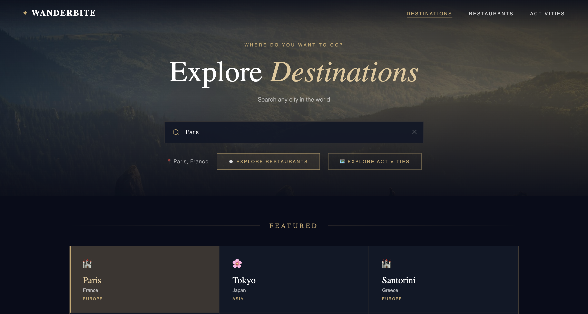
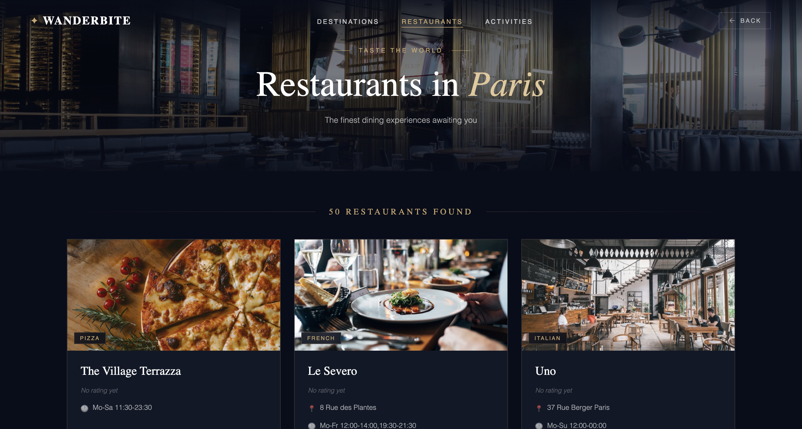
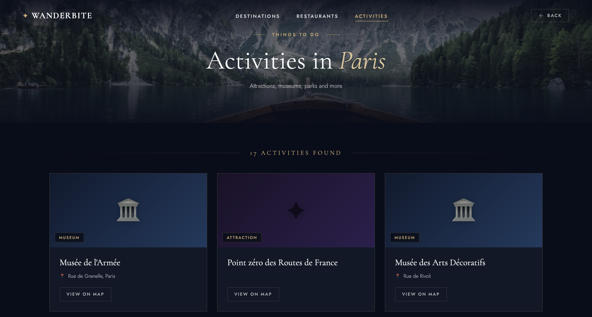

# WanderBite

A **micro-frontend travel app** built with Angular, React, and Webpack Module Federation — exploring
cities, restaurants, and local attractions around the world.






## Live Demo

| App                   | URL                                      |
| --------------------- | ---------------------------------------- |
| **Shell (main site)** | _(Netlify — add your URL)_               |
| Homepage              | _(wanderbite-homepage.netlify.app)_      |
| Destinations          | _(wanderbite-destinations.netlify.app)_  |
| Restaurants           | https://wanderbite-food.vercel.app       |
| Activities            | https://wanderbite-activities.vercel.app |

## Tech Stack

- **Angular 21** — shell, homepage, destinations, restaurants (micro-frontends)
- **React 19** — activities micro-frontend (cross-framework MFE)
- **Nx 22** — monorepo tooling, build orchestration
- **Webpack Module Federation** — runtime micro-frontend composition
- **PrimNG 21** — Angular UI components
- **OpenStreetMap / Overpass API** — restaurant and attraction data (no API key required)

## Features

- Search any city worldwide with autocomplete (Open-Meteo geocoding)
- Browse nearby **restaurants** with cuisine types and ratings
- Explore **attractions, museums, and viewpoints** with Wikimedia Commons photos
- Selected city persists across navigation tabs via `localStorage`
- Angular shell dynamically loads a React remote at runtime (cross-framework MFE)

## Architecture

```
apps/
  shell/          # Angular host — orchestrates all remotes (port 4200)
  homepage/       # Angular remote — landing page (port 4201)
  destinations/   # Angular remote — city search & featured destinations (port 4202)
  food/           # Angular remote — restaurants (port 4203)
  activities/     # React remote — attractions & activities (port 4204)
libs/
  shared/utils/   # Shared types and services
```

The **activities** app is a React 19 micro-frontend loaded via script tag injection rather than
Module Federation, solving the CommonJS/ES-module boundary between Angular's enhanced MF runtime
and React's standard webpack container.

## Getting Started

### Prerequisites

```bash
node >= 20
npm >= 10
```

### Install

```bash
git clone <repo-url>
cd wanderbite
npm install
```

### Run all apps together

```bash
npx nx run-many -t serve -p shell homepage destinations food activities --parallel=5
```

Then open http://localhost:4200

### Run each app independently

| App          | Command                     | URL                   |
| ------------ | --------------------------- | --------------------- |
| Shell        | `npx nx serve shell`        | http://localhost:4200 |
| Homepage     | `npx nx serve homepage`     | http://localhost:4201 |
| Destinations | `npx nx serve destinations` | http://localhost:4202 |
| Restaurants  | `npx nx serve food`         | http://localhost:4203 |
| Activities   | `npx nx serve activities`   | http://localhost:4204 |

> **Note:** Start remotes before the shell. Recommended order: `homepage` → `destinations` → `food` → `activities` → `shell`

### Build for production

```bash
# Build all apps
npx nx run-many -t build -p shell homepage destinations food activities --parallel=5

# Build a single app
npx nx build food --configuration=production
```

### Clear cache (if you see phantom errors after a fix)

```bash
npm exec nx reset
```

## APIs Used

All APIs are free and require no API key.

| API                          | Purpose                         |
| ---------------------------- | ------------------------------- |
| Open-Meteo Geocoding         | City autocomplete search        |
| Overpass API (OpenStreetMap) | Restaurants and attraction data |
| Wikimedia Commons            | Activity card photos            |
| Unsplash (static URLs)       | Restaurant placeholder images   |

## Deployment

- Angular remotes (homepage, destinations) → **Netlify**
- React + Angular remotes (food, activities) → **Vercel**
- Shell → **Netlify**
